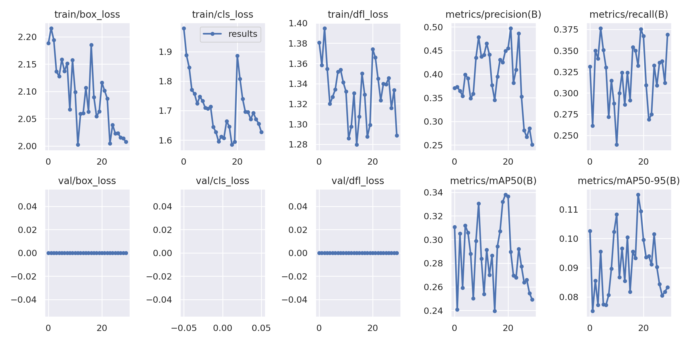
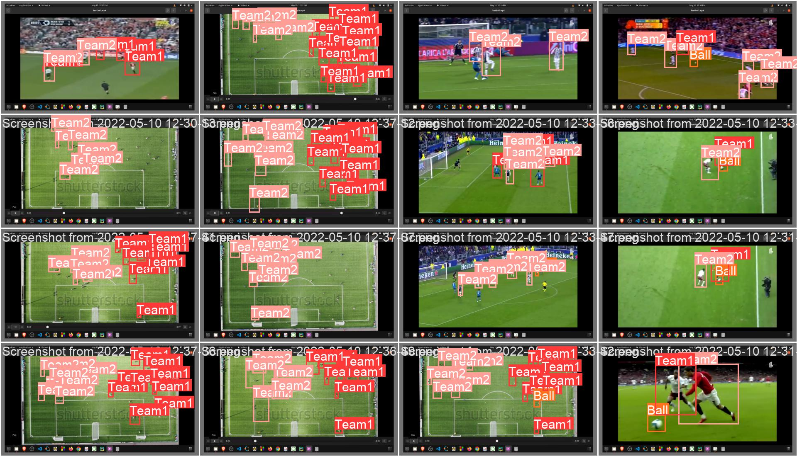

<h3 align="left">Football Player detection:</h3>
<h3 align="center">I have used yolov8 to detect football players. the dataset is been taken from kaggle and it is publicly available</h3>
[Dataset Link](>https://www.kaggle.com/datasets/venkatkumar001/football-analysis)

<h3 align="left">Languages and Tools:</h3>

      

<h3 align="left">Predictions & Graph:</h3>

  
  
  
  

